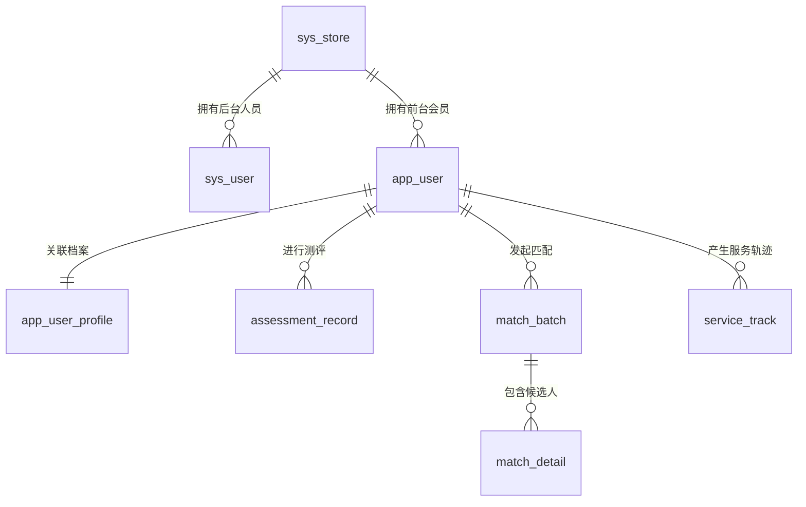

# 幸福力婚恋系统架构与数据库设计文档

| 文档版本 | 日期 | 编写 | 说明 |
| :--- | :--- | :--- | :--- |
| v1.0 | 2026-01-11 | AI Assistant | 基于PRD v1.0进行技术架构与数据建模 |

本文档详细描述了“幸福力”项目的技术实现方案，重点在于**多租户数据隔离**的底层设计、**动态档案**的存储结构以及**核心算法**的技术落地。

---

## 1. 技术栈选型 (Tech Stack)

### 1.1 后端技术栈
*   **开发语言**：Java (Spring Boot) 或 Python (Django/FastAPI) / Node.js (NestJS)
    *   *建议使用 Java Spring Boot，因其在企业级复杂业务、强类型约束及生态成熟度上的优势，适合处理复杂的匹配算法和多租户逻辑。*
*   **数据库**：MySQL 8.0+
    *   *利用 JSON 类型存储复杂的测评答卷和非结构化档案数据。*
*   **缓存中间件**：Redis
    *   *用于 Token 存储、ID 生成器的原子计数、高频配置缓存。*
*   **对象存储**：腾讯云 COS / 阿里云 OSS
    *   *存储用户大头照、测评结果生成的图片等。*

### 1.2 前端技术栈
*   **前台 H5**：Vue 3 / React + Vant UI (移动端适配)
*   **后台 Web**：Vue 3 / React + Ant Design Pro (企业级后台)
*   **路由鉴权策略**：
    *   **白名单机制**：默认所有路由需登录 (Auth Required)。仅 `HomeView` (首页/Landing Page)、`Login`、`Register` 配置 `meta: { noAuth: true }`。
    *   **路由守卫**：全局 `beforeEach` 钩子拦截非白名单路由，未登录用户重定向至登录页（携带 `redirect` 参数）。
*   **UI 组件策略**：
    *   核心组件（表单、按钮等）使用 Vant 4。
    *   **全局反馈 (Toast)**：为确保兼容性，采用自定义轻量级封装 `utils/toast.ts`，不依赖第三方库样式。

---

## 2. 系统架构设计

### 2.1 多租户隔离策略 (Tenant Isolation)
系统采用 **"共享数据库，共享数据表"** 模式，通过 `store_id` 字段在应用层进行逻辑隔离。

*   **数据层**：
    *   普通用户（前台/后台）：必须绑定 `store_id`。
    *   **超级管理员**：`store_id` 为 `NULL`（特殊身份标识）。
*   **逻辑层 (Service/Controller)**：
    *   **门店私有视野**：普通后台用户执行查询时，后端强制在 SQL 中注入 `WHERE store_id = current_user.store_id`。
    *   **全局数据视野**：超级管理员执行查询时，若未指定门店，则不加 `store_id` 过滤条件（查全量）；若指定了门店，则查询特定门店数据。

### 2.2 ID 生成器架构
为了满足 PRD 中特定的 ID 格式规则（如 `XFL001G13702`），不能使用数据库自增 ID 或 UUID。

*   **方案**：**Redis 原子计数器 (INCR) + 格式化策略**
*   **流程**：
    1.  **门店 ID**：`XFL` + Redis Key `sys:store:seq` (3位，补0)。
    2.  **用户 ID**：
        *   前缀：`Current_Store_ID` (如 XFL001)。
        *   后缀：Redis Key `sys:user:seq:{store_id}` (5位)。
        *   **混淆策略**：为避免ID连续暴露业务量，采用 **线性同余生成器 (LCG)** 或 **Feistel Cipher** 算法，将 Redis 的连续序列号映射为伪随机的唯一数字（即需求中的“随机偏移量”），保证全局唯一且不可预测。

---

## 3. 数据库设计 (Schema Design)

### 3.1 核心实体关系图 (Simplified ER Diagram)



### 3.2 题库数据管理策略

**设计决策**：测评题库（九型人格、依恋关系、婚恋幸福力）采用 **后端常量存储** 而非数据库存储。

**理由**：
1. **题目内容相对固定**：基于经典心理学量表，修改频率极低。
2. **性能最优**：内存读取，零数据库查询开销。
3. **版本管理便捷**：题目变更随代码 Git 提交，可追溯历史。
4. **开发效率高**：无需维护题库表的数据同步和迁移。
5. **安全性一致**：题目内容对用户可见（前端需展示），放数据库或代码对安全性无本质影响。核心竞争力在于**计算逻辑和匹配算法**（严格保护在后端）。

**实现方式**：
- 题库以 TypeScript 常量形式存储于 `backend/src/constants/questions/` 目录。
- API 接口直接返回常量数据，保持前后端分离架构。
- 测评结果、用户答卷仍存储于数据库 `assessment_record` 表，确保数据持久化和统计分析。

---

### 3.3 详细表结构定义

#### A. 基础管理模块

**1. 门店表 (`sys_store`)**
| 字段名 | 类型 | 说明 | 索引 |
| :--- | :--- | :--- | :--- |
| **id** | CHAR(6) | PK, 门店ID (如 XFL001) | PRIMARY |
| name | VARCHAR(50) | 门店名称 | |
| mv_template_id | INT | 绑定的MV地域方案ID (1-5) | |
| business_license_name | VARCHAR(200) | 营业执照名称 | |
| credit_code | VARCHAR(50) | 统一社会信用代码 | IDX |
| province | VARCHAR(50) | 省份 | |
| city | VARCHAR(50) | 市 | |
| district | VARCHAR(50) | 区 | |
| address | VARCHAR(200) | 详细地址 | |
| contact_person | VARCHAR(50) | 联系人 | |
| contact_phone | VARCHAR(20) | 联系电话 | |
| contract_number | VARCHAR(100) | 合同号 | |
| contract_start_date | DATE | 签约时间 | |
| contract_end_date | DATE | 到期时间 | |
| status | TINYINT | 1:正常, 0:禁用 | |
| created_at | DATETIME | | |

**2. 后台用户表 (`sys_user`)**
| 字段名 | 类型 | 说明 | 索引 |
| :--- | :--- | :--- | :--- |
| **id** | VARCHAR(20) | PK, 后台用户ID (XFL001G...) | PRIMARY |
| store_id | CHAR(6) | 所属门店 (超级管理员可为 NULL) | IDX_STORE |
| username | VARCHAR(50) | 登录账号/用户名 | |
| name | VARCHAR(50) | 真实姓名 | |
| id_card | VARCHAR(18) | 身份证号 | IDX |
| password | VARCHAR(100) | 加密密码 (BCrypt) | |
| phone | VARCHAR(20) | 手机号 | IDX |
| role | VARCHAR(20) | 角色: super_admin(超管), admin(老板), manager(负责人), matchmaker(红娘) | |
| status | TINYINT | 1:正常, 0:待审核, -1:禁用 | |

#### B. 用户档案模块

**3. 前台用户表 (`app_user`)**
| 字段名 | 类型 | 说明 | 索引 |
| :--- | :--- | :--- | :--- |
| **id** | VARCHAR(20) | PK, 前台用户ID (XFL001...) | PRIMARY |
| store_id | CHAR(6) | 所属门店 | IDX_STORE |
| phone | VARCHAR(20) | 手机号 (全局唯一) | UNIQUE |
| password | VARCHAR(100) | 加密密码 | |
| status | TINYINT | 1:正常, 0:禁用 | |
| created_at | DATETIME | 注册时间 | |
| updated_at | DATETIME | | |

**4. 用户档案表 (`app_user_profile`)**
*核心表，包含同步字段与编辑字段。*
| 字段名 | 类型 | 说明 |
| :--- | :--- | :--- |
| **user_id** | VARCHAR(20) | PK, FK -> app_user.id |
| **base_info** | JSON | **基础信息（JSON存储）**：含姓名(name)、性别(gender)、生日(birthday)、身高(height)、体重(weight)、学历(education)、婚况(marriage)、民族(ethnicity)、头像(avatar_url)等 |
| **ext_info** | JSON | **扩展信息（JSON存储）**：含收入(income)、房产(house)、车(car)、长相分(appearance_score)、家庭背景(family_bg)等 |
| **mv_score** | DECIMAL(5,2) | 当前计算出的MV总分 |
| mv_detail | JSON | MV各维度得分详情：{age_score: 12.5, bmi_score: 10.5, ...} |
| service_matchmaker_id | VARCHAR(20) | 服务红娘ID |
| created_at | DATETIME | |
| updated_at | DATETIME | 档案更新时间 (用于触发MV重算) |

> **设计思路**：考虑到档案字段极多且可能调整，将核心用于搜索筛选的字段（如年龄、身高、学历）设为独立列（Virtual Generated Columns 可选），其余大量描述性字段存入 JSON，既保证灵活性又支持高效索引。

#### C. 测评与业务模块

**5. 测评记录表 (`assessment_record`)**
| 字段名 | 类型 | 说明 |
| :--- | :--- | :--- |
| id | BIGINT | PK, 自增 |
| user_id | VARCHAR(20) | FK |
| type | TINYINT | 1:九型, 2:依恋, 3:幸福力 |
| answers | JSON | 原始答卷数据 |
| **result_data** | JSON | 结构化结果 |
| raw_scores | JSON | 原始得分数据 |
| is_latest | TINYINT | 是否最新记录: 1-是, 0-否 |
| created_at | DATETIME | |

**6. 匹配批次表 (`match_batch`)**
| 字段名 | 类型 | 说明 |
| :--- | :--- | :--- |
| id | BIGINT | PK |
| store_id | CHAR(6) | 门店隔离 |
| initiator_id | VARCHAR(20) | 发起方用户ID |
| filter_criteria | JSON | 当时的筛选条件快照 |
| created_at | DATETIME | 匹配发起时间 |

**7. 匹配明细表 (`match_detail`)**
| 字段名 | 类型 | 说明 |
| :--- | :--- | :--- |
| id | BIGINT | PK |
| batch_id | BIGINT | FK -> match_batch.id |
| candidate_id | VARCHAR(20) | 候选方用户ID |
| mv_diff | DECIMAL(5,2) | MV分差 |
| is_mv_pass | TINYINT | MV是否通过 |
| is_personality_pass| TINYINT | 九型是否通过 |
| result_status | TINYINT | 最终系统判定: 1通过, 0不通过 |
| match_data | JSON | 匹配详情数据快照 |

**8. 服务轨迹表 (`service_track`)**
*实现双向关联的核心表*
| 字段名 | 类型 | 说明 | 索引 |
| :--- | :--- | :--- | :--- |
| id | BIGINT | PK | |
| store_id | CHAR(6) | | |
| **initiator_id** | VARCHAR(20) | 本方用户ID | IDX_INIT |
| **target_id** | VARCHAR(20) | 对方用户ID (关联对象) | IDX_TARGET |
| type | TINYINT | 1:匹配反馈, 2:约见记录, 3:治疗记录 | |
| status | TINYINT | 进度状态 | |
| feedback_content | TEXT | 详细反馈内容/治疗记录 | |
| event_time | DATETIME | 匹配/约见时间 | |
| created_by | VARCHAR(20) | 记录人(红娘ID) | |
| created_at | DATETIME | | |

---

## 4. 核心功能技术实现方案

### 4.1 动态 MV 计算引擎
由于 MV 计算依赖地域方案（5套规则）和用户档案（实时变动），采用 **策略模式 (Strategy Pattern) + 事件驱动** 实现。

1.  **定义规则接口**：`MvCalculationStrategy`，包含 `calculateMale()` 和 `calculateFemale()`。
2.  **实现5套策略**：`GuangdongStrategy`, `JiangzheStrategy` 等，硬编码或配置化具体的评分区间规则。
3.  **触发机制**：
    *   当 `app_user_profile` 表发生 `UPDATE` 操作（或用户完成测评时）。
    *   发布 `UserProfileUpdatedEvent`。
    *   监听器捕获事件 -> 获取用户门店 -> 获取门店绑定的 MV 模板 ID。
    *   **特殊逻辑**：计算女性MV时，需查询 `assessment_record` 获取最新的九型人格测评结果，读取 `resultData.matchableOppositeCount`（可匹配异性数量）作为“性格”维度的评分依据。
    *   调用对应策略计算总分及明细 -> 更新 `mv_score` 和 `mv_detail` 字段。

### 4.2 九型人格匹配算法
*   **数据结构**：在内存中定义 9x9 的匹配矩阵 `int[][] MATCH_MATRIX`，存储 +1, 0, -1。
*   **计算流程**：
    ```java
    // 伪代码
    List<Integer> maleTypes = male.getTop3Types(); // e.g., [1, 3, 5]
    List<Integer> femaleTypes = female.getTop3Types();
    
    boolean isPass = true;
    int matchCount = 0;
    
    for (int m : maleTypes) {
        for (int f : femaleTypes) {
            int score = MATCH_MATRIX[m][f];
            if (score == -1) {
                isPass = false; // 一票否决
                break;
            }
            if (score == 1) {
                matchCount++; // 记录重合度
            }
        }
        if (!isPass) break;
    }
    ```

### 4.3 门店数据隔离方案 (MyBatis Plus 示例)
利用 `TenantLineInnerInterceptor` 插件实现透明隔离。

```java
public class StoreIsolationHandler implements TenantLineHandler {
    @Override
    public Expression getTenantId() {
        // 从 ThreadLocal / SecurityContext 中获取当前登录红娘的 store_id
        String storeId = SecurityContextHolder.getUser().getStoreId();
        return new StringValue(storeId);
    }

    @Override
    public String getTenantIdColumn() {
        return "store_id";
    }

    @Override
    public boolean ignoreTable(String tableName) {
        // 超级管理员操作或非业务表可忽略
        return "sys_store".equals(tableName) || UserContext.isSuperAdmin();
    }
}
```

---

## 5. 接口设计规范 (API Design)

遵循 RESTful 风格，所有接口统一前缀 `/api/v1`。

> **命名约定**：
> *   **API 层**：请求参数与响应 JSON 数据统一使用 **驼峰命名法 (camelCase)**（如 `storeId`, `createdAt`）。
> *   **数据库层**：表名与字段名统一使用 **蛇形命名法 (snake_case)**（如 `store_id`, `created_at`）。
> *   **后端映射**：TypeORM Entity 需显式配置 `@Column({ name: 'snake_case_name' })` 以确保映射正确。

### 5.1 鉴权与上下文
*   **Header**: `Authorization: Bearer <token>`
*   **Token Payload**: 包含 `uid`, `role`, `store_id`。后端收到请求后解析 Token，将 `store_id` 注入请求上下文，供数据库隔离插件使用。
*   **接口访问控制**：
    *   **Public API**：`GET /api/v1/assessments/{type}/questions` (获取题目)，允许无 Token 访问，提升首屏加载速度。
    *   **Protected API**：所有提交 (`/submit`)、查询历史 (`/history`)、档案操作接口，必须携带有效 Token。

### 5.2 核心接口示例

*   `POST /api/v1/assessments/enneagram` : 提交九型人格测试，返回计算结果。
*   `POST /api/v1/matches/initiate` : 发起匹配。
    *   Payload: `{ initiator_id: "...", criteria: { age_min: 25, ... } }`
    *   Response: `{ batch_id: 101, results: [ { candidate_id: "...", match_score: 95, ... } ] }`
*   `GET /api/v1/profiles/{id}` : 获取用户档案（包含根据权限过滤的敏感字段）。

---

## 6. 安全性设计

1.  **字段脱敏**：使用 Jackson Serializer，在 JSON 序列化阶段检查当前用户角色。若为“普通红娘”，则将 `app_user.phone` 字段掩码处理 (138****1234)。
2.  **ID 防猜测**：如前所述，用户 ID 虽然包含门店信息，但序列号部分应经过混淆，防止通过 ID 自增规律爬取数据。
3.  **越权防御**：所有涉及 `user_id` 的操作，必须校验该用户是否属于当前操作者的 `store_id`（虽然数据库层有隔离，业务层仍需二次校验以防逻辑漏洞）。

